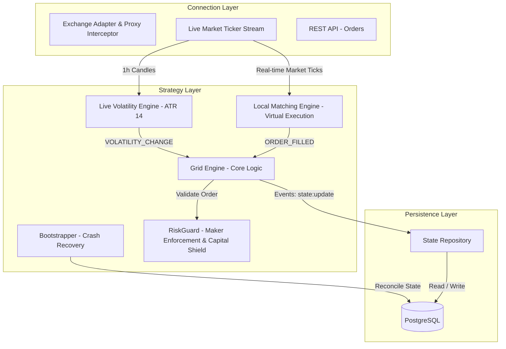

# 🤖 Bot de Grid Trading para BTC (Bitcoin)

Bot de trading algorítmico autónomo desarrollado en Node.js y TypeScript, especializado en el mercado de Bitcoin (BTC). Diseñado para operar en entornos de alta disponibilidad y aprovechar la volatilidad intradiaria mediante rangos adaptativos por **ATR (Average True Range)**.

---

## 📌 Visión General & Modelo Económico

El objetivo principal de este proyecto es capturar ganancias a través de oscilaciones intradiarias de precio en un rango especificado (por ejemplo, oscilaciones de $3,000 USD en 15 niveles de ~$214 USD).

### 💡 Análisis de Comisiones y Protección de Rentabilidad (Maker vs Taker):

- **Diferencial por Escalón (Gross Spread):** Con un escalón de $214.29 USD en BTC ($64,500 USD), el spread bruto de cada ciclo de compra-venta es del **~0.33%**.
- **Regla Estructural #1: Operar Exclusivamente con Órdenes Maker (Limit):**
  - Las órdenes `LIMIT` califican como **Maker** en el libro de órdenes con comisiones reducidas del **0.05%** por trade (**0.10%** por ciclo completo compra + venta).
  - **Rendimiento Neto Garantizado:** $0.33\% - 0.10\% =$ **+0.233% neto por ciclo completado** (+0.166 USD en cada trade de $71.40 USD).
- **Regla Estructural #2: Prohibición Estricta de Órdenes Taker (A Mercado):**
  - Las órdenes `MARKET` o Taker cobran comisiones de hasta **0.20%** por trade (**0.40%** por ciclo completo).
  - Si el bot enviara órdenes a mercado, el costo de $0.40\%$ superaría el beneficio del $0.33\%$, generando una **pérdida neta del -0.07%**.
  - **Enforcement en Código:** El módulo [`RiskGuard`](file:///home/luna/repos/dayTradingBot/src/core/riskGuard.ts) rechaza automáticamente cualquier orden que no sea explícitamente `type: 'limit'` con un precio mayor a 0.
- **Regla Estructural #3: Blindaje de Capital Asignado (`MAX_GRID_ALLOCATION_USD`):**
  - Para aislar el patrimonio del usuario, `RiskGuard` rechaza cualquier orden si la asignación proyectada de la grilla supera el límite absoluto especificado en el entorno (ej: `$2,000.00 USD`).

---

## 💻 Cómo Levantar el Dashboard Financiero Local

El proyecto incluye un dashboard web interactivo desarrollado en **Next.js (App Router), Tailwind CSS, TradingView Lightweight Charts y Prisma**.

### Paso 1: Iniciar el Túnel SSH (Conexión Segura a la Base de Datos en AWS EC2)
Ejecuta en tu terminal local:
```bash
ssh -i ./Downloads/trading-bot-key.pem -N -L 5433:localhost:5432 ubuntu@100.27.216.84
```
*(Este comando abre un túnel encriptado del puerto local `5433` al puerto PostgreSQL `5432` en AWS sin exponer la base de datos a internet)*.

### Paso 2: Levantar el Dashboard Frontend
En otra ventana de tu terminal local:
```bash
cd dashboard
npm run dev
```

Abre tu navegador en: **`http://localhost:3001`**

---

## 📊 Módulo de Backtesting Histórico (`npm run backtest` / `npm run backtest:batch`)

El simulador de backtesting descarga datos reales de **velas de 1 minuto (`1m OHLCV`)** de los últimos 90 días usando CCXT y los almacena en caché local (`data/btc_usdt_1m_90d.json` - 129,601 velas) para evaluar estrategias de forma instantánea.

### 📄 Reportes Disponibles en la Rama Main:
- 📌 **Reporte Base (Grilla Estática):** [`BACKTEST_REPORT.md`](file:///home/luna/repos/dayTradingBot/BACKTEST_REPORT.md) (+7.574% ROI en 90 días).
- 📌 **Estrategia 1 (Trailing Up):** [`BACKTEST_TRAILING_UP_REPORT.md`](file:///home/luna/repos/dayTradingBot/BACKTEST_TRAILING_UP_REPORT.md) (+3.456% ROI en 30 días).
- 📌 **Estrategia 2 (Trailing Down / Stop-Loss):** [`BACKTEST_TRAILING_DOWN_REPORT.md`](file:///home/luna/repos/dayTradingBot/BACKTEST_TRAILING_DOWN_REPORT.md) (-1.984% ROI a 30 días por liquidación a pérdida).
- 📌 **Estrategia 3 (Grilla Adaptativa ATR):** [`BACKTEST_ATR_VOLATILITY_REPORT.md`](file:///home/luna/repos/dayTradingBot/BACKTEST_ATR_VOLATILITY_REPORT.md) (**+31.127% ROI en 90 días**).

---

## 🚀 Despliegue en AWS con GitHub Actions CI/CD

El repositorio incluye un pipeline automatizado en [`.github/workflows/deploy.yml`](file:///home/luna/repos/dayTradingBot/.github/workflows/deploy.yml) y una guía detallada en [`AWS_DEPLOYMENT_GUIDE.md`](file:///home/luna/repos/dayTradingBot/AWS_DEPLOYMENT_GUIDE.md) para desplegar el bot en una instancia **AWS EC2** con Docker Compose.

---

## 🏗️ Arquitectura del Sistema



---

## 📁 Estructura de Directorios

```plaintext
.github/
└── workflows/          # Pipeline CI/CD automatizado para AWS EC2
dashboard/              # Dashboard Frontend en Next.js (App Router, Tailwind, TradingView)
src/
├── config/             # Variables de entorno y validación Zod (Riesgo y ATR)
├── core/               # Lógica de negocio pura, Reconciliación, Matching Engine y ATR
│   ├── atrCalculator.ts
│   ├── bootstrapper.ts
│   ├── gridManager.ts
│   ├── matchingEngine.ts
│   ├── riskGuard.ts
│   └── volatility.ts
├── backtest/           # Módulo de simulación histórica sobre velas OHLCV 1m
│   ├── backtester.ts
│   ├── batch.ts
│   └── run.ts
├── exchange/           # Capa de infraestructura (CCXT Adapter, Shadow Proxy & WS)
│   ├── adapter.ts
│   ├── shadowAdapter.ts
│   └── streams.ts
├── db/                 # Capa de persistencia (ORM Prisma & Repositorio de Estado)
│   └── repository.ts
└── index.ts            # Punto de entrada (Bootstrapping, Siembra e Integración)
```

---

## 🛠️ Stack Tecnológico & Testing

- **Lenguaje:** TypeScript / Node.js
- **Exchange API:** CCXT (Binance Spot API público).
- **Testing:** Vitest (26/26 tests unitarios pasados).
- **Base de Datos:** PostgreSQL + Prisma ORM.
- **Validación de Datos:** Zod.
- **Manejo de Eventos:** `EventEmitter` (nativo de Node.js).
- **Precisión Numérica:** Decimal.js.
- **Despliegue:** Docker (`Dockerfile` y `docker-compose.yml`) + GitHub Actions CI/CD.
