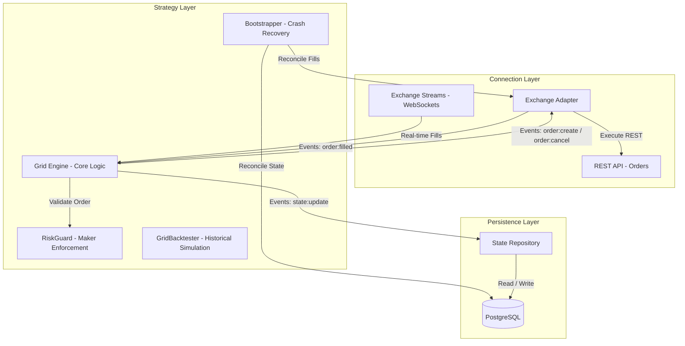

# 🤖 Bot de Grid Trading para BTC (Bitcoin)

Bot de trading algorítmico autónomo desarrollado en Node.js y TypeScript, especializado en el mercado de Bitcoin (BTC). Diseñado para operar en entornos de alta disponibilidad y aprovechar la volatilidad intradiaria mediante rangos de precios definidos.

---

## 📌 Visión General & Modelo Económico

El objetivo principal de este proyecto es capturar ganancias a través de oscilaciones intradiarias de precio en un rango especificado (por ejemplo, oscilaciones de $3,000 USD en 15 niveles de ~$214 USD).

### 💡 Análisis de Comisiones y Protección de Rentabilidad (Maker vs Taker):

- **Diferencial por Escalón (Gross Spread):** Con un escalón de $214.29 USD en BTC ($64,500 USD), el spread bruto de cada ciclo de compra-venta es del **~0.33%**.
- **Regla Estructural #1: Operar Exclusivamente con Órdenes Maker (Limit):**
  - Las órdenes `LIMIT` califican como **Maker** en el libro de órdenes con comisiones reducidas del **0.05%** por trade (**0.10%** por ciclo completo compra + venta).
  - **Rendimiento Neto Garantizado:** $0.33\% - 0.10\% =$ **+0.233% neto por ciclo completado** (+0.166 USD en cada trade de $71.40 USD).
- **Regla Estructural #2: Prohibición Estricta de Órdenes Taker (A Mercado):**
  - Las órdenes `MARKET` o Taker cobran comisiones de hasta **0.20%** por trade (**0.40%** por ciclo completo).
  - Si el bot enviara órdenes a mercado, el costo de $0.40\%$ superaría el beneficio del $0.33\%$, generando una **pérdida neta del -0.07%**.
  - **Enforcement en Código:** El módulo [`RiskGuard`](file:///home/luna/repos/dayTradingBot/src/core/riskGuard.ts) rechaza automáticamente cualquier orden que no sea explícitamente `type: 'limit'` con un precio mayor a 0.

---

## 📊 Fase 1: Módulo de Backtesting Histórico (`npm run backtest`)

El simulador de backtesting descarga datos reales de **velas de 1 minuto (`1m OHLCV`)** de los últimos 7 días usando CCXT para evaluar el rendimiento sin arriesgar capital:

### Resultados del Backtest (Últimos 7 Días - 10,081 velas):
```text
⏱️ Período Simulado: 7 Días (168 horas / 10,081 velas de 1m)
🔄 Total FLIPS Completados: 83 ciclos
----------------------------------------------------
💰 Inversión Inicial: $1,000.00 USD
💵 Ganancia Bruta Acumulada: $19.65 USD
💸 Comisiones Simuladas (0.05% Maker): $5.60 USD
📈 BENEFICIO NETO: $14.05 USD (+1.405% ROI en 7 días)
----------------------------------------------------
⚠️ Tiempo Inactivo Fuera de Rango ($63,000 - $66,000):
   └─ Horas inactivo: 10.87 hrs (6.47% del tiempo total)
```

---

## 🏗️ Arquitectura del Sistema

El sistema utiliza una arquitectura modular y orientada a eventos dividida en tres capas principales:



---

## 📁 Estructura de Directorios

```plaintext
src/
├── config/             # Variables de entorno y validación de configuración de grilla (Zod)
├── core/               # Lógica de negocio pura, Reconciliación y Tests
│   ├── bootstrapper.ts
│   ├── bootstrapper.test.ts
│   ├── gridManager.ts
│   ├── gridManager.test.ts
│   ├── riskGuard.ts
│   └── riskGuard.test.ts
├── backtest/           # Módulo de simulación histórica sobre velas OHLCV 1m
│   ├── backtester.ts
│   ├── backtester.test.ts
│   └── run.ts
├── exchange/           # Capa de infraestructura externa (CCXT REST Wrapper & WS Streams)
│   ├── adapter.ts
│   ├── streams.ts
│   └── streams.test.ts
├── db/                 # Capa de persistencia (ORM Prisma & Repositorio de Estado)
│   └── repository.ts
├── types/              # Interfaces globales, eventos y esquemas de Zod
└── index.ts            # Punto de entrada (Bootstrapping, Siembra e Integración)
```

---

## 🛠️ Stack Tecnológico & Testing

- **Lenguaje:** TypeScript / Node.js
- **Exchange API:** CCXT (Binance Testnet / Live WS streams gratis).
- **Testing:** Vitest (19/19 tests unitarios pasados).
- **Base de Datos:** PostgreSQL + Prisma ORM.
- **Validación de Datos:** Zod.
- **Manejo de Eventos:** `EventEmitter` (nativo de Node.js).
- **Precisión Numérica:** Decimal.js.
- **Despliegue:** Docker (`Dockerfile` y `docker-compose.yml`).

---

## 🚀 Comandos Principales

### Ejecutar Backtest Histórico:
```bash
npm run backtest
```

### Ejecutar Suite de Tests:
```bash
npm test
```

### Compilar Proyecto:
```bash
npm run build
```

### Desarrollo Local:
```bash
npm run dev
```
